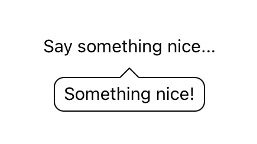
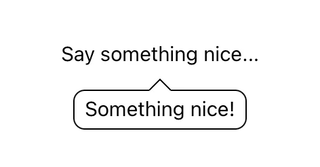

# SwiftUI Tooltip


[](https://www.buymeacoffee.com/bring.shrubbery)

This package provides you with an easy way to show tooltips over any SwiftUI view, since Apple does not provide one.

<p align="center">
      
</p>

## Getting started

You can add this package to your project using Swift Package Manager. Enter following url when adding it to your project package dependencies:

```
https://github.com/quassum/SwiftUI-Tooltip.git
```

We are using [semver](https://semver.org) for versioning, so we would recomment selecting "Up to next major relase" option for this package.

After you added the package, all you need to do is import it and you can add a tooltip to any SwiftUI View in that file!

## Usage

### Basic use case

As the first example, the `Text` view is provided as the tooltip content and it's attached to the other `Text` view.
Below you can see the example of code that is required to create the tooltip and the result you see on the screen.

*Code:*

```swift
import SwiftUITooltip
...
Text("Say something nice...")
    .tooltip(.bottom) {
        Text("Something nice!")
    }
...
```

*Result:*



### Using custom configuration to add a jumping animation

Second example shows you how you can add jumping animation to the tooltip from the first example.

*Code:*

```swift
import SwiftUI
import SwiftUITooltip

struct SwiftUIView: View {
    var tooltipConfig = DefaultTooltipConfig()
    
    init() {
        self.tooltipConfig.enableAnimation = true
        self.tooltipConfig.animationOffset = 10
        self.tooltipConfig.animationTime = 1
    }
    
    var body: some View {
        Text("Say something nice...")
            .tooltip(.bottom, config: tooltipConfig) {
                Text("Something nice!")
            }
    }
}
```

*Result:*



## Configuration Reference

Below you can see all the properties that you can set in the configuration.

| Property               | Type          | Description                                          |
| ---------------------- | ------------- | ---------------------------------------------------- |
| `side`                 | `TooltipSide` | Side of view that the tooltip should appear on       |
| `margin`               | `CGFloat`     | Margin from the tooltip to the view it's attached to |
| `borderRadius`         | `CGFloat`     | Rounded border control                               |
| `borderWidth`          | `CGFloat`     | Thickness of the border                              |
| `borderColor`          | `Color`       | Border color                                         |
| `backgroundColor`      | `Color`       | Background color inside of the tooltip               |
| `contentPaddingLeft`   | `CGFloat`     | Left padding inside of the tooltip                   |
| `contentPaddingRight`  | `CGFloat`     | Right padding inside of the tooltip                  |
| `contentPaddingTop`    | `CGFloat`     | Top padding inside of the tooltip                    |
| `contentPaddingBottom` | `CGFloat`     | Bottom padding inside of the tooltip                 |
| `showArrow`            | `Bool`        | Whether to show or hide the arrow                    |
| `arrowWidth`           | `CGFloat`     | Width of the base of the triangle                    |
| `arrowHeight`          | `CGFloat`     | Height of the triangle                               |
| `enableAnimation`      | `Bool`        | Whether to bounce the tooltip or not                 |
| `animationOffset`      | `CGFloat`     | Delay between tooltip bouncing animations            |
| `animationTime`        | `Double`      | How long should the tooltip bounce last              |

## Contributing

If you like this package but feel that you need more control or custom implementation - feel free to open an issue, send a pull request or fork the repo!

**Reward function:** Contributors with even smallest PRs will be added to the list in the [Contributors](https://github.com/quassum/SwiftUI-Tooltip#contributors) section!

## Contributors

- [Antoni Silvestrovic (author)](https://github.com/bring-shrubbery)
- [subarnasantra](https://github.com/subarnasantra)
- [Ariel Elkin](https://github.com/arielelkin)
- [William Chen](https://github.com/chenium)

## License

This package is licensed under [MIT License](LICENSE)
